---

# 自己紹介

## かすてらふぃ 
- `npub168ghgug469n4r2tuyw05dmqhqv5jcwm7nxytn67afmz8qkc4a4zqsu2dlc`
- NIP-05: [jiftechnify@c-stellar.net](https://iris.to/jiftechnify@c-stellar.net)
- Twitter: @cstl_fy 
- GitHub: jiftechnify
- 職業: フルスタックソフトウェアエンジニア(?)
- 趣味: 打楽器演奏、音楽ゲーム 

---

# TL; DR

- 「`limit`を指定しなければ過去のイベント全部取れる」は**大間違い**
- 確実に過去の全イベントを取得するには…
    - リレー実装ごとの細かな挙動の違いを把握した上で
    - 時間を遡るように繰り返しイベントの取得を行う必要がある
- ↑をいい感じにやるライブラリを作った

---

# 事の発端

みんななんか作っとる、何も作ってないのはお前だけ

→ フォロー整理アプリ作るか〜

→ フォロイーがアクティブかどうか知りたい
- 最終投稿時刻
- 過去 n 日間の投稿数

→ 特定の人が**過去に送った投稿を全部取得**した上で集計する必要がある

---

# Nostrの基本


---

# イベント取得の流れ

**購読** (subscription):
リレーから特定の条件を満たすイベントを取得する手続き

1. リレーに`REQ`メッセージを送信
    - 取得したいイベントの条件を表す**フィルタ**を指定
2. **リレーから条件に一致する過去のイベントがまとめて送られてくる**
3. リレーから`EOSE`メッセージが送られてくる
    - End Of Stored Events
    - 過去のイベントはここまでよ、という合図
4. 以降、リレーから条件に一致するイベントがリアルタイムに送られてくる

---

# フィルタ

```
// REQメッセージの中身
["REQ", "sub_id", {"authors": [...], "kinds": [...], ...}]
                  ^^^^^^^^^^^^^^^^^^^^^^^^^^^^^^^^^^^^^^^ フィルタ
```

| フィールド | 条件 |
|:--|:--|
|`ids`|イベントID|
|`authors`|イベント発行者|
|`kinds`|イベントの種類(例: `0` = プロフィール, `1` = 投稿)|
|`#x`|特定のタグの値(例: `#p`→ `p`タグの値)|
|`since`/`until`|イベント発行時刻(`since`以降`until`以前)|
|`limit`|過去のイベントの最大取得数|

---

# 全取得など朝飯前…?

`limit`を指定しなければ、過去イベントの取得数を制限しないことになる
→ 過去のイベントを全部取得できる?

**世の中そんなに甘くない**

リレーによって挙動が全然違う！
- 期待通りにすべてのイベントが返ってきたり
- 明らかに返ってくるイベントの数が少なすぎたり
- 新しい順に返ってきたり、古い順に返ってきたり

---

# 仕様と実装、あるいは理想と現実

仕様: 「Nostrリレーを名乗るからには、こんな風に動いてくれ！」というルール
- リレーの動作に関係するNIPs: -01, -15(`EOSE`) など

実装: ~~だいたい~~仕様通りの動きをするソフトウェア
- Nostrリレー実装の例: nostr-rs-relay, nostream, strfry など

仕様に書かれていない部分については、実装側の都合のいいように作っていい
特に、Nostrプロトコルは全体的に仕様がゆるい
→ その結果がこのありさまだよ！！！

---

# 敵を知る

今のところ、確実にすべてのイベントを取得するには、
リレー実装ごとの細かな**挙動の違い**を知る必要がある。

とはいえ、すべての実装を調べるのは数が多すぎて困難
→ **よく使われているリレー実装に絞って調査**

---

# 三大リレー実装

[nostr.watchの統計ページ](https://nostr.watch/relays/statistics)によると、**nostr-rs-relay**, **nostream** の2つが圧倒的。

**strfry** は採用絶対数は少ないものの、利用者が多いリレーでの採用実績が目立つ
- relay.damus.io
- nos.lol
- nostr.wine

--- 

# 三大リレー実装の実装詳細 (1)
`limit`を指定した場合の動作

**nostr-rs-relay**
- 指定数のイベントを、新しい順に返す

**nostream**
- 指定数のイベントを、新しい順に返す
- **`limit`が5000を超える場合、`REQ`を送信した時点でエラー**
    - 上限値 5000 は固定

**strfry**
- 指定数と「500件」のうち少ない方の数のイベントを、新しい順に返す
    - 「500件」はデフォルト設定の値で、変更可能

---

# 三大リレー実装の実装詳細 (2)
`limit`を指定しない場合の動作

**nostr-rs-relay**
- すべてのイベントを、**古い順**に返す

**nostream**
- **500件**のイベントを、**古い順**に返す
    - 「500件」という数字は固定

**strfry**
- **500件**のイベントを、新しい順に返す
    - 「500件」はデフォルト設定の値で、変更可能
---

# 三大リレー実装の実装詳細 (3)

以上より、過去のイベントの取得に関して信頼できる動作は…

- **`limit`を指定すれば、最近のイベントが(新しい順に)返ってくる**

だけ。

実は、NIP-01でさらっと明言されている
> When `limit: n` is present it is assumed that the events returned in the initial query will be the **latest** n events.


---

# 三大リレー実装の実装詳細 (4)
`since`/`until`に関する動作(取得対象となるイベントの範囲)

**nostr-rs-relay**
- **`since` ＜ `created_at` ＜ `until`**

**nostream**
- `since` ≦ `created_at` ≦ `until`

**strfry**
- `since` ≦ `created_at` ≦ `until`

---

# 漏れなくすべてのイベントを取得するアルゴリズム

1. フィルタの`until`を現在時刻、`limit`を5000に設定して
   購読を行い、`EOSE`までのイベントを取得
    - 最新のイベントを最大5000件取得できる
2. 前回新しく取得したイベントのうち、**最も古いもの**の時刻を求める
3. フィルタの`until`を 2. で求めた時刻 **+ 1** 、`limit`を5000に設定して
   購読を行い、`EOSE`までのイベントを取得
    - 「前回取得したイベント中で最も古いもの」より前のイベントのうち、
       最新の最大5000件を取得

4. 2., 3. を新しいイベントが取得できなくなるまで繰り返す


---


---



---


---



---


---



---


---

# 複数リレーの場合

先程のアルゴリズムを**各リレーに対して**実行し、結果を統合する

リレーごとに持っているイベントは違うので、
繰り返しごとに指定する `until` もリレーごとに異なってくる

→ 複数のリレーに対し**同一の**フィルタで購読を行うしくみである
nostr-tools の SimplePool は、**今回の用途には全く役に立たない！**

---

# nostr-fetch のご紹介

以上のアルゴリズムを1から実装するのはそれなりに大変なので…

**「Nostrのリレーから漏れなくすべての過去のイベントを取ってくる」** ことに特化した
TypeScript / JavaScript 向けライブラリ **nostr-fetch** を作って公開しました(宣伝)

- [npm](https://www.npmjs.com/package/nostr-fetch) `https://www.npmjs.com/package/nostr-fetch`
- [GitHub](https://github.com/jiftechnify/nostr-fetch) `https://github.com/jiftechnify/nostr-fetch`

```ts
import { NostrEvent, NostrFetcher } from 'nostr-fetch';

const fetcher = new NostrFetcher();
const events: NostrEvent[] = await fetcher.fetchAllEvents(...);

const eventsIter = await fetcher.allEventsIterator(...);
for await (const e of eventsIter) {
    // ...
}
```

---

# nostr-fetch の特長

- 過去の全イベント取得に加え、最新 n 件、最新 1 件のみの取得に対応
- 全イベントを回す `AsyncIterator` を返すAPI (`allEventsIterator`)
    - 非同期に返ってくるイベントを `for-await-of` ループで直感的に処理できる
- 全イベント取得では、もちろん日時範囲の指定も可能
- 複数リレーからの取得に対応 (最低限のコネクション管理つき)

---

# Future Works

- 購読に失敗した場合のリトライ
    - レートリミットに引っかかった場合など
    - 購読失敗時のエラーメッセージの仕様が標準化されてほしい…
- Developer Experienceの向上
    - アカウント(公開鍵)ごとの最新イベントを簡単に取れるようにしたい
- エラー処理、テスト…

- フォロー管理アプリ、過去のTLを遡るアプリを作る
