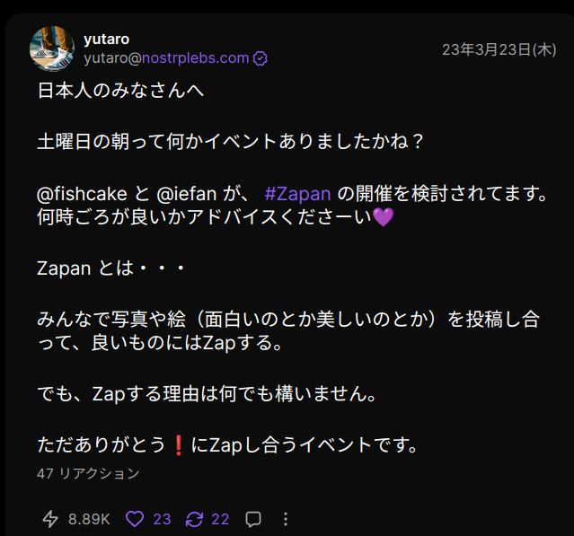
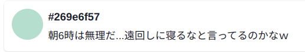
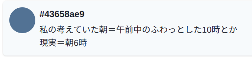
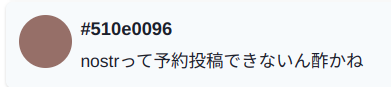
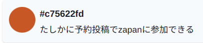

<!-- Nostrにおける予約投稿の実現可能性を考える -->


---

# 自己紹介

## かすてらふぃ 
- NIP-05: [jiftechnify@c-stellar.net](https://snort.social/p/jiftechnify@c-stellar.net)
- Website: [c-stellar.net](https://c-stellar.net)
- NostrのTLを遡るツール:
[Nosaray](https://nosaray.vercel.app/)(のさらい) 作者


---

# 事の発端: #Zapan
毎週金・土曜日の __*朝* 6:00〜6:30__ に
`#Zapan`タグをつけて投稿し、
Zap(投げ銭)を送り合うイベント

cf. https://scrapbox.io/nostr/Zapan



---
<!-- _class: center-text -->

**朝 6:00 ~ 6:30**

---
<!-- _class: center-text -->

**起きられない😇**

---
# 予約投稿機能を求める声たち






---
<!-- _class: center-text-->

**そうだ 予約投稿、しよう。**

---
# 手法1: CLIクライアントを指定時刻に実行

`algia`([https://github.com/mattn/algia](https://github.com/mattn/algia)) と `at`コマンドを組み合わせる

```bash
# 次の金曜日の朝6時に 'pura vida' と投稿
echo "algia post 'pura vida'" | at 06:00 Fri

# 次の土曜日の朝6時に ぽわ〜 と投稿
echo "algia powa" | at 06:00 Sat
```

長所:
- お手軽

短所:
- **指定時刻にPCが起動している必要がある**
- コマンドラインに馴染みがない人には厳しいかも

---
# 手法2: `created_at`を未来に設定して投稿

Nostrのイベントには `created_at`(発行時刻) を好きに設定できる

→ `created_at`を未来の投稿したい時刻に設定すれば、予約投稿になる…?

結論: **なるっちゃなるが不確実**

- リレーによって、`created_at`が未来なイベントの扱いが異なる
- `created_at`が現在時刻から大きく離れたイベントを受け付けないリレーも
    - cf. NIP-22 ([https://scrapbox.io/nostr/NIP-22](https://scrapbox.io/nostr/NIP-22))

---
<!-- _class: center-text-->

**誰にでも使えて**
**確実に投稿できる**
**予約投稿システム**
**_欲しい！_**

---
# 予約投稿システムの素朴な設計

1. 時刻を指定して、システムに投稿内容を登録
2. 指定時刻になったら、システムがイベントを送信


---
# 署名はどうする?

Nostrイベントには、投稿者の秘密鍵による署名を含める必要がある

→ 予約投稿システムがイベントを発行できるようにするには、
　投稿者の秘密鍵をシステムに渡す必要がある…?

**そんなシステムを誰が使うだろうか?** (いや、誰も使わない)

---
# 先に署名させておけばいいじゃない

投稿内容ではなく、署名済みのイベントをシステムに登録すれば上手くいく!

1. 指定時刻(未来)の`created_at`を設定した投稿イベントを生成
2. **生成したイベントに署名を行う**
3. システムに**署名済みのイベント**を登録
4. 指定時刻になったら、システムが**署名済みのイベント**を送信

システムは、ひたすら登録されたデータをそのままリレーに送るだけ
→ **投稿者の秘密鍵を知らなくてもよい**

---
# 設計図解



---
# 実装は?

- Nostr It ([https://nostrit.com/](https://nostrit.com/))
    - 通信内容を覗いた感じ、おそらく今回説明した仕組みで動いている
    - ハッシュタグ未対応
- ハッシュタグ対応版を独自に実装したい(未完成🙇)

---
# まとめ

- Nostr上で実現可能な予約投稿の仕組みを検討した


